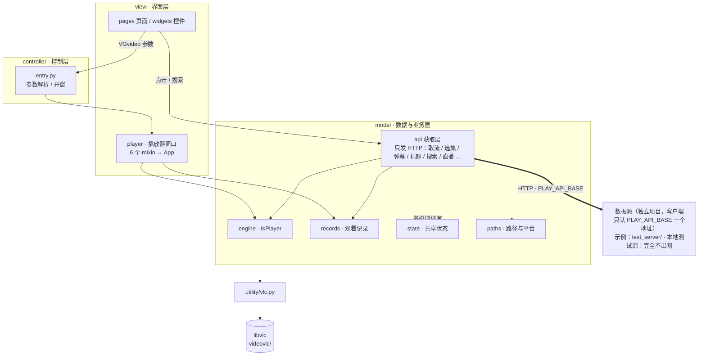

# VG视频

> 基于 **Tkinter + libvlc** 的桌面视频客户端。取流、搜索、直播、观看记录续播、HLS 下载转码，全部收在一个开箱即用的 Python 工程里。

`Python 3` · `Tkinter` · `libvlc 3.0.11` · `MVC 三层` · `Windows / macOS / Linux`（桌面增强能力仅 Windows）

---

## 关于本项目

> 这个项目是我很久之前的项目，大部分使用古法编程开发，最近拿出来开源才使用少量使用ai润色，之所以将它开源出来，是希望可以展示一下老框架的所拥有的能力，以及作为一个学习的参考。


---

## 目录

- [项目简介](#项目简介)
- [功能一览](#功能一览)
- [快速开始](#快速开始)
- [目录结构](#目录结构)
- [架构分层](#架构分层)
- [分层详解](#分层详解)
- [关键设计](#关键设计)
- [配置文件](#配置文件)
- [观看记录格式](#观看记录格式)
- [配套脚本速查](#配套脚本速查)
- [项目规模](#项目规模)
- [结构整理记录](#结构整理记录)

---

## 项目简介

VG视频 是一个**单机桌面视频客户端**，但它不是"某个网站的客户端"，而是一个**装得下任何视频源的壳子**：

- **数据源可换** —— 界面上要的每一份数据（取流 / 选集 / 弹幕 / 标题 / 搜索 / 轮播 / 热词 / 联想词 / 图片 / 直播频道）都只向**一个 HTTP 地址**要，这个地址就是 `config/config.json` 里的 `vgapi.PLAY_API_BASE`。客户端**不出网、不起服务、不占端口**，"换源"就是改这一行；具体提供数据的**数据源是独立项目**，不随本客户端发布。
- **本地测试数据源** —— `test_server/`（本地测试源：假数据全在本地、一个字节都不出网，专门用来验证"换一个源，客户端一行代码都不用改也能跑通"）即此类数据源的一个样例。
- **播放** —— 播放地址拿到后交给本地 VLC 内核，画质与流畅度不受浏览器限制。
- **本地视频** —— 菜单或拖拽打开本地文件，同样走 VLC 内核。
- **观看记录** —— 每个剧集一个 JSON 文件，记到第几集、播到第几秒，下次点"继续播放"直接接上。
- **下载** —— HLS 分片并发抓取 + remux 成 mp4（不重编码）。

只要一个数据源照约定的接口清单把这十几份 JSON 喂出来，**不需要改客户端任何一行代码**即可接入 —— 这就是"壳子"的意思。`test_server/` 就是这个约定的活样板。

工程本身也做过一次完整的结构整理：原来一个几千行的 `main.py` 单文件，现在拆成 **model / view / controller** 三层 + `utility` / `config` / `test` 三个辅助目录，界面与业务彻底分开，配置、工具、调试脚本各归其位。

> 平铺版文件速查（按"哪个文件干什么"逐条列）见仓库里的 `测试脚本清单.txt`，本文档侧重结构与架构。

---

## 功能一览

| 模块 | 能力 |
| --- | --- |
| **数据源** | 客户端只认 `PLAY_API_BASE` 一个地址，数据源以独立项目形式提供、可直接互换；换源只改配置不改动客户端代码 |
| **首页** | 轮播大图（在线海报，失败回落本地占位图）、"大家在看"、四个推荐位 |
| **搜索** | 标准 JSON 接口，输出标准化结果，支持翻页、热词下拉、搜索联想 |
| **观看记录** | 扫描 `Recordset/` 按最近观看时间排序，显示剧名与进度，一键续播 |
| **直播** | 按频道名分类的直播间列表，点封面直接起播放器 |
| **播放器窗口** | 无边框 + 八向边缘缩放、全屏进出、倍速、进度条、选集宫格/单列、弹幕与评论、面板宽度可拖 |
| **下载** | aria2 并发下分片 → ffmpeg concat 直接 remux 成 mp4；加密清单交给 ffmpeg 自行拉流 |
| **本地播放** | 菜单选择或窗口拖拽本地文件；支持外部以命令行参数唤起播放指定剧集 |

---

## 快速开始

### 环境要求

| 项 | 说明 |
| --- | --- |
| Python | 3.8+（工程已在 3.11 / 3.14 上跑通） |
| 第三方库 | `Pillow`（界面上所有图片都靠它缩放） |
| 标准库 | `tkinter`（Python 自带，Linux 下需装 `python3-tk`） |
| 播放内核 | `libvlc` 动态库已内置在 `videovlc/`，绑定脚本是 `utility/vlc.py`，**无需单独安装 VLC** |
| 可选外部工具 | `aria2c.exe` / `ffmpeg.exe` 丢进 `utility/` 即可自动启用加速与转码；不放则退回内置实现 |

### 运行

**数据服务与客户端是两个独立进程**：数据源是**独立项目**，需自行启动（**命令行启动**，客户端不会替你起、也不会占你的端口），然后客户端通过 `PLAY_API_BASE` 连接它的地址。

```bash
# 在程序目录（本 README 所在目录）下执行

# 1) 启动数据源（独立项目，具体启动方式见该数据源自己的说明），例如本地测试源：
python test_server/app.py      # 本地测试源:默认 127.0.0.1:8790(完全不出网)

# 2) 把客户端指向它 —— 只改 config/config.json 里的这一行
#    "PLAY_API_BASE": "http://127.0.0.1:8790"      ← 本地测试源示例
#    顺手把 "PLAY_API_CMD" 抄成第 1 步敲的那条命令(该项只是记录,程序不执行)

# 3) 开客户端
python main.py
```

启动后会依次完成：建 `config/` 与 `Recordset/`（并把旧版配置自动归拢、升级为当前 JSON 格式）→ 切换工作目录 → 注入配置 → 装载接口层 → 打开主界面。

想验证"壳子"这件事，用 `test_server/` 最直观：它没有任何网络请求，封面是现算的 PNG、音轨是现算的 WAV，但轮播 / 搜索 / 选集 / 播放 / 弹幕 / 直播一样能跑 —— 这就说明界面层没有和数据源绑死，换源真的只是换个地址。往 `test_server/media/` 丢一个 mp4，`/play` 给的地址就会指向它。

### 打包

用 PyInstaller 时注意三点：

```bash
pyinstaller -w -i ico/logo.ico -n VG视频 main.py --paths utility --add-data "ico/logo.ico;ico"
```

1. **入口是 `main.py`**（根目录），不是 `video.py`；
2. **必须带 `--paths utility`** —— `vlc.py` / `max_win.py` / `windnd.py` / `ToolTips.py` 收在 `utility/` 里，但这种顶层导入方式需要打包器知道去哪收集，否则 `import vlc` 会失败；
3. **图标要 `-i` 与 `--add-data` 一起给** —— `-i` 只是把图标写进 exe 资源，程序运行时读的是 `application_path`（`_MEIPASS`）下的 `ico/logo.ico`，得靠 `--add-data` 才能一并打进去。Linux / macOS 上 `--add-data` 的分隔符是 `:` 而不是 `;`。

打包后程序自己会处理"只读资源目录（`_MEIPASS`）"与"可写数据目录（exe 同级）"的区分，配置文件与观看记录都落在 exe 旁边。

### 打包（Nuitka）

仓库里带了现成脚本 `build_nuitka.bat`（双击即可；要中文程序名就先设好环境变量再运行，脚本本身保持纯 ASCII 以免批处理读乱中文）：

```bat
set VG_NAME=VG视频 & set VG_DESC=VG视频桌面视频客户端 & build_nuitka.bat
```

产物在 `build_nuitka\main.dist\`（首次全量约 17 分钟，之后只改数据/资源约 2 分钟）；`build_nuitka\main.build\` 是编译缓存，删掉会退化成全量重编，建议留着。脚本等价于：

```bash
python -m nuitka --standalone --assume-yes-for-downloads --jobs=4 --low-memory \
  --enable-plugin=tk-inter --windows-console-mode=disable \
  --windows-icon-from-ico=ico/logo.ico --output-dir=build_nuitka \
  --output-filename=VG视频.exe --include-raw-dir=videovlc=videovlc \
  --include-data-dir=ico=ico --include-data-dir=rotation_local=rotation_local \
  --include-data-dir=config=config \
  --include-data-files=utility/aria2c.exe=utility/aria2c.exe \
  --include-data-files=utility/ffmpeg.exe=utility/ffmpeg.exe \
  --include-module=vlc --include-module=max_win --include-module=windnd --include-module=ToolTips \
  --company-name=VGVideo --product-name=VG视频 main.py
```

四个坑：

1. **`--jobs` 别开满** —— 12 核机器上 Nuitka 默认开 12 路并发，zig 会报 `SystemResources` 直接崩（崩时根目录会留下 `nuitka-crash-report.xml`，直接删掉即可），`--jobs=4 --low-memory` 稳定；
2. **`videovlc/` 必须用 `--include-raw-dir`** —— `--include-data-dir` 有一份"代码类后缀"黑名单（`.dll` / `.exe` / `.pyd` …），会静默跳过 VLC 519 个文件里的 303 个 dll，包能启动但实际用的是**本机安装的 VLC**；`--include-raw-dir` 关掉整份黑名单；
3. **取流实现不在客户端** —— 抓取本体整体由数据源项目提供（客户端只发 HTTP 取数），所以打包无需、也不应把数据源的取流脚本带进客户端；
4. **Nuitka 不设 `sys.frozen`** —— `model/paths.py` 会走源码分支，实测冻结后 `dirname(dirname(__file__))` 正好落在 dist 目录，因此 `application_path` / `_run_dir` 都等于 exe 所在目录（配置与观看记录仍落在 exe 旁边），代码不用为 Nuitka 额外适配；代价是 `sys.path` 里那句 `if not getattr(sys, 'frozen', False)` 仍会执行，所以 `--paths`/`PYTHONPATH` 指到 `utility/` 这一步不能省（`import vlc` 是动态导入，得靠 `--include-module=vlc,max_win,windnd,ToolTips` 收进去）。

---

## 目录结构

```text
video/
├── main.py                     程序入口：启动环境 → 接口接线 → 进主界面
├── ico/                        图标资源（只读，随程序一起分发）
│   └── logo.ico                程序图标
├── README.md                   本文档
│
├── model/                      M —— 数据与业务（不画界面）
│   ├── state.py                跨模块共享状态（全程序唯一一处可变全局）
│   ├── paths.py                程序目录 / 配置文件 / 平台标记（基础层）
│   ├── records.py              观看记录 Recordset/<剧集id>.json 的读写
│   ├── engine.py               VLC 播放引擎薄壳（tkPlayer）
│   ├── download.py             aria2 + ffmpeg 下载
│   ├── uiprefs.py              界面偏好记忆
│   └── api/                    只负责“获取”（主程序只从这一层 import）
│       ├── __init__.py         汇总出口：from model.api import *
│       ├── config.py           可调配置（读取 config/config.json 的 vgapi 段）
│       ├── client.py           唯一出网口：request_text / request_json / request_bytes
│       ├── util.py             纯本地工具：抠 vid / 剧集 id、播放页判定、播放地址日志
│       ├── remote.py           播放地址获取调用层（调数据服务 /play，管缓存与失败原因）
│       ├── live_src.py         直播间频道表（数据来自 GET /live）
│       ├── qq.py               数据获取实现：选集 / 弹幕 / 标题（HTTP 接口）
│       ├── discover.py         轮播海报 / 搜索热词 / 联想词 / 图片代理
│       └── search.py           搜索结果数据源（数据来自 GET /search）
│
├── view/                       V —— 界面（画控件 + 绑回调）
│   ├── chrome.py               无边框窗口公共逻辑 + 输入框剪贴板助手
│   ├── icons.py                窗口 / 任务栏 / 程序坞图标
│   ├── image.py                图片等比缩放与文本兼容工具
│   ├── widgets/                通用控件
│   │   ├── searchbox.py        搜索框
│   │   ├── titlebar.py         标题栏三键 + ≡ 菜单
│   │   ├── leftnav.py          左侧 12 项导航
│   │   ├── carousel.py         轮播与四个推荐位
│   │   ├── episode.py          选集按钮
│   │   ├── suggest.py          热词下拉
│   │   └── nav.py              首页标签 / 导航控件取用助手
│   ├── pages/                  内容页面（一页一文件一入口）
│   │   ├── main.py             主窗口 VG_video（窗口骨架 + 事件分发 + 切页）
│   │   ├── home.py             首页
│   │   ├── search.py           搜索结果页
│   │   ├── history.py          观看记录页
│   │   └── live.py             直播间列表（频道表来自数据服务 GET /live）
│   └── player/                 播放器窗口（6 个职责 mixin + 组装）
│       ├── app.py              组装成 App
│       ├── playback.py         播放核心：建窗、后台解析地址、开播、换集、释放
│       ├── view.py             播放画面与窗口：画布、控制条、全屏、缩放
│       ├── panel.py            右侧面板宽度：拖动分隔条、悬浮、跟随缩放
│       ├── progress.py         底部进度条与倍速
│       ├── episodes.py         右侧选集表
│       └── comments.py         右侧评论 / 弹幕
│
├── controller/                 C —— 流程控制
│   └── entry.py                命令行参数解析 + 打开播放器窗口
│
├── utility/                    运行期模块 + 手动工具 + 外部工具停放处
│   ├── vlc.py                  libvlc 3.0.11 的 Tk 绑定（第三方，随 import 收集）
│   ├── max_win.py              取任务栏工作区做最大化（仅 Windows）
│   ├── windnd.py               窗口拖拽支持
│   ├── ToolTips.py             Tk 气泡提示
│   ├── add_record_names.py     观看记录补剧名（手动跑）
│   └── aria2c.exe / ffmpeg.exe 可选：放这里就被自动使用
│
├── config/                     配置文件（要改配置只动这里）
│   ├── config.json             主配置：数据源地址 / 下载目录 + 服务端参数
│   └── uiprefs.json            界面偏好（程序自己维护）
│
├── test/                       调试与自测脚本
│   ├── play.py                 取播放地址 + 试播的调试脚本
│   ├── test_qq.py              数据源接口自测（取流 / 标题 / 选集 / 弹幕）
│   └── search_api.py           搜索接口调试
│
├── Recordset/                  观看记录数据（一个剧集一个 JSON，数据不是配置）
├── rotation_local/             轮播图本地回落占位图
└── videovlc/                   libvlc 动态库（303 个 dll / 插件）
```

---

## 架构分层



> 界面层要的每一份数据（取流 / 选集 / 弹幕 / 标题 / 搜索 / 轮播 / 热词 / 联想词 / 图片 / 直播频道表）都由 `model/api/` 向**数据源**要：客户端自己不出网，抓取本体全在数据源那边，客户端一律不出网。
> 上面画的是 `test_server/`（本地测试源），换成别的数据源整张图除"谁在出网"之外完全不变，这正是"壳子"的含义。

**依赖规则**

| 层 | 允许依赖 | 说明 |
| --- | --- | --- |
| `model` | 只依赖自身 + 标准库 | **不 import view / controller**，可被任何地方安全引用 |
| `view` | model、controller | 界面代码里仍混着事件处理，沿用原有设计 |
| `controller` | model | 叶子模块（页面、控件）也会直接调 `VGvideo()` 开播放窗口，这条 `view → controller` 依赖是原有设计，保留不动 |
| `utility` | 无 | 被当作顶层模块导入，见[关键设计](#关键设计) |

**一次"点开一个视频"的链路**

```text
点击推荐位 / 搜索到剧集
      ↓
controller.entry.VGvideo("video.exe 2 <剧集id> <目录>")   参数解析 → 写入 state.argv
      ↓                                                  查询观看记录，定位续播集数
view.player.app.App                                      组装 6 个 mixin 的播放器窗口
      ↓
model.api._resolve_url(...)                              后台线程向数据服务要真实播放地址
      ↓
model.engine.tkPlayer.set_uri(...)                       → utility/vlc.py → libvlc 播放
      ↓
model.records._rec_save(...)                             定时回写集数与进度
```

---

## 分层详解

### `model` —— 数据与业务

| 文件 | 职责 |
| --- | --- |
| `state.py` | 跨模块共享状态集中地。拆分成多文件后 `global xxx` 只能改自己所在文件，因此统一收敛到这里，其它模块一律读写 `state.xxx`。内含运行期状态、主题与轮播参数、选集列表引用、控件注册表四块 |
| `paths.py` | 基础层。算 `application_path`（打包后 `_MEIPASS`，只放只读资源）与 `_run_dir`（真正的程序目录，可写数据都在这）；统一 `config/` 下配置文件的路径与旧版数据升级；把 `utility/` 挂进 `sys.path`；提供平台标记与 `windll` |
| `records.py` | 观看记录。JSON 写法，一个剧集一个文件，记事本能直接看懂手改；启动时自动整理旧版记录 |
| `engine.py` | 在 `vlc.py` 之上的一层薄壳 `tkPlayer`，把播放 / 暂停 / 进度 / 音量 / 倍速 / 字幕包成直白方法；播放地址日志由外部注入，避免反向依赖 |
| `download.py` | 下载。aria2 负责搬字节（并发抓分片），ffmpeg 负责合成 mp4（concat remux 不重编码）；外部工具找不到就退回内置实现 |
| `uiprefs.py` | 界面偏好记忆（当前只记播放器面板宽度占比）。单独开文件是刻意的：`config.json` 由人工维护、说明文字收在 `_readme` 键里，程序回写会把它重排并丢掉手写部分，所以主配置只读，能写的偏好另放一份 |

### `model/api` —— 获取层

整个程序**只从这一层 import**，不和任何具体实现绑死；以后换接口、换数据源，改这里的出口就行。

这一层的定位只有四个字：**只负责获取**。所有数据都是向数据源要回来的，抓取本体（取流、搜索接口、直播源、图片代理……）一行都不在客户端。唯一会出网的文件是 `client.py`，其余模块都是"拼请求 → 收结果 → 返回"。

| 模块 | 内容 |
| --- | --- |
| `config.py` | 所有可调参数集中处。优先级：主程序运行时注入 → `config/config.json` 的 `vgapi` 段 → 文件内置默认值。注意其中部分是**数据源项目参数**，客户端不读，只是与数据源共用同一份 `config.json` |
| `client.py` | **客户端唯一出网口**：`request_text` / `request_json` / `request_bytes` 三个函数，统一拼 `PLAY_API_BASE`、带上 `X-Api-Token`、控超时。全部"失败返回空值、不抛异常"，保证界面不会因为网络问题崩掉 |
| `util.py` | 纯本地工具，不联网：抠 vid / 剧集 id、判断是不是播放页、播放地址日志。老代码里散落的正则与判定统一收在这里 |
| `remote.py` | 播放地址获取的唯一调用层：调数据服务的 `/play`，管客户端缓存与失败原因（`resolve_url` / `_resolve_url` / `play_api_health` / `source_line`） |
| `live_src.py` | 直播间频道表：数据来自 `GET /live`（内置清单与备用源都由数据源抓） |
| `qq.py` | 数据获取实现：选集 `/episodes`、弹幕 `/danmu`、标题 `/title`。函数名与老代码一致，只是实现换成了发 HTTP |
| `discover.py` | 轮播海报 `/rotation`、搜索热词 `/hot_words`、搜索联想词 `/suggest`、图片代理 `/image`（取回字节后用 PIL 打开） |
| `search.py` | 搜索结果数据源：数据来自 `GET /search`，结构是数据源约定的"标准 JSON"（`source` / `keyword` / `page` / `pages` / `total` / `items`），界面直接照这份结构渲染 |

> 抓取实现（取流、签名、聚合等）整体由**数据源项目**提供，**禁止手改客户端里的对应模块**；升级时由数据源项目整体覆盖。

### `view` —— 界面

- **`chrome.py`** —— `Window_chrome`：八向边缘缩放、无边框拖动、边框显隐、任务栏恢复，另附输入框复制 / 剪切 / 粘贴助手。真正的顶层窗口统一是 `self.window`。
- **`icons.py`** —— `App_icon`：窗口 / 任务栏 / 程序坞图标的唯一入口。`use_process_identity()` 建窗口前调一次，任务栏才会认程序自己的 logo。
- **`image.py`** —— 等比缩放贴图、BMP 外字符转代理对、窗口 `attributes` 逐项安全设置。
- **`widgets/`** —— 只放"多个页面都要用"的零散能力：搜索框（原来同一段代码在主窗口抄了三遍）、标题栏三键、左侧 12 项导航、轮播与推荐位、选集、热词下拉。
- **`pages/`** —— 一页一文件一入口：`home` / `search` / `history` / `live`，加上只负责骨架与切页的 `main.VG_video`。
- **`player/`** —— 原来 1179 行的 `App` 按职责切成 6 个 mixin，`app.py` 单行继承拼回同一个类：

  ```python
  class App(PlaybackMixin, PlayerViewMixin, PanelMixin, ProgressMixin,
            EpisodesMixin, CommentsMixin, Window_chrome, tk.Toplevel):
  ```

  方法名互不重复，谁先谁后都不影响行为；每个 mixin 通过 `self` 与其它部分协作，合并后与原来的 `App` 等价。

### `controller` —— 控制

`entry.py` 解析 `"video.exe 2 <剧集id> <下载目录>"` 这类内部命令行参数（模式 1 本地文件 / 2 剧集 / 3 单视频 / 4 直播地址），写入 `state.argv` 与续播集数，再打开播放窗口；同一时刻只允许一个播放器窗口。同时负责两处"接线"：观看记录取当前播放器、播放地址日志出口。

### `utility` —— 运行期模块与工具

`vlc.py` / `max_win.py` / `windnd.py` / `ToolTips.py` 是**运行期模块**，被 `main.py`、`model/engine.py`、`view/pages/main.py` 直接 `import`；`add_record_names.py` 是**手动跑的工具**；这个目录同时是 `aria2c.exe` / `ffmpeg.exe` 的停放处。

### `config` 与 `test`

- `config/` —— 配置文件的唯一归属地（`config.json` 主配置 + `uiprefs.json` 界面偏好）。程序启动时会自动整理旧版配置并迁移到当前 JSON 文件。
- `test/` —— 不参与运行的调试与自测脚本，都通过 `import main as video` 复用主程序的接口。

---

## 关键设计

**1. `utility/` 里的模块仍按顶层名导入**

`vlc.py`、`max_win.py`、`windnd.py`、`ToolTips.py` 收进了 `utility/`，但全项目仍写 `import vlc` / `import max_win`。做法是让基础层 `model/paths.py` 在被导入时把 `utility/` 挂进 `sys.path`：

```python
if not getattr(sys, 'frozen', False):
    if os.path.isdir(_UTIL_DIR) and _UTIL_DIR not in sys.path:
        sys.path.insert(0, _UTIL_DIR)
```

好处是零 import 改动；代价是**打包必须带 `--paths utility`**，且源码运行时 `paths.py` 必须比 `import vlc` 更早执行（`main.py` 第 38 行确实最先导入它）。

**2. 共享状态只此一处**

拆分前这些数据是单文件里的模块级全局，靠 `global xxx` 在各函数间共享。拆成多文件后 `global` 作用域不再互通，于是统一收进 `model/state.py`，读也是 `state.xxx`、写也是 `state.xxx` —— 行为与拆分前一致，而且"哪些数据是共享的"一眼可见。

**3. 配置能自动搬家，也能自己升级格式**

`_config_path()` 优先认 `config/` 下的新位置；若 `config/` 里没有而根目录有，就认旧的（不迁）。启动时 `_ensure_data_files()` 再把根部的配置文件一次性 `os.replace` 进 `config/` —— 老用户直接覆盖升级也不会丢配置。

当前配置统一使用 JSON：`config.json` 负责人工维护的主配置，`uiprefs.json` 负责程序自动保存的界面偏好；下载目录也统一保存在 `config.json` 的 `path.download_dir` 中。启动时会自动创建缺失目录与默认配置，读取异常时使用安全默认值，避免配置问题阻塞程序启动。

**4. 接口出口唯一**

`main.py` 只用一句 `from model.api import *` 拿到全部接口，并顺手把接口名留在自己模块的命名空间里 —— 所以 `test/` 下的脚本 `import main as video` 后可以直接 `video._resolve_url(...)`。接口层内部一度按"数据源 / 非数据源"分成子包、靠模块级 `__getattr__` 互相转发；现已合并成 `model.api` 一个包，模块平铺在一层，包内没有子目录，对外出口始终只有 `from model.api import *` 这一句。

**5. 网络层不抛异常**

`model/api/client.py` 里所有函数都是"失败返回 `None` / 空值、不抛异常"（数据源连不上时只会看到空列表 + 失败原因），界面层因此不需要到处包 try。

**6. `"video.exe"` 只是一个命令行协议词**

`controller/entry.py` 用 `"video.exe" in x` 识别参数、`view/pages/*.py` 用 `VGvideo("video.exe 2 <剧集id> <目录>")` 传参 —— 这里的 `video.exe` 是**程序内部拼的固定单词**（模拟"外部命令唤起播放器"的行为），与源文件名无关。程序入口 `video.py` 已改名为 `main.py`，这些协议串**故意保持原样**，改它们要动十几个调用点而收益为零。

**7. 失败退化而非崩溃**

- 轮播海报拉不到 → 回落 `rotation_local/` 本地占位图；
- `aria2c` / `ffmpeg` 缺失 → 退回内置下载实现；
- `vlc` 库缺失 → 导入时警告，实例化播放器才报错；
- 平台不支持的窗口 `attributes` → 逐项尝试、跳过。

---

## 配置文件

配置文件统一收在 `config/` 里，改配置只动这里，不用碰代码。格式统一是 **JSON**：段名作顶层键（旧 `[vgapi]` 段 → `"vgapi"` 键），键名沿用全大写；以 `_` 开头的键（每个文件开头的 `_readme`）是给人看的说明，读取端一律忽略。

| 文件 | 用途 | 读写方 |
| --- | --- | --- |
| `config/config.json` | 主配置：数据源地址、下载目录（`path.download_dir`）等 | 程序 **只读**（人工维护，说明收在 `_readme` 键里，不会被回写冲掉）；标题栏"文件下载位置"选完只改 `path.download_dir` 这一项 |
| `config/uiprefs.json` | 界面偏好（当前记播放器面板宽度占比），整份删掉即恢复默认 | 程序读写 |

自己动手写 JSON 时注意三点：

- 类型跟着语义走：布尔写 `true` / `false`，数字写数字。
- `%` 和 `;` 在 JSON 字符串中按普通字符填写，不需要额外转义。
- 路径里的 `\` 按 JSON 规则写成 `\\`，或者直接用 `/`。

`config.json` 的 `vgapi` 段几个关键项：

| 键 | 说明 |
| --- | --- |
| `PLAY_API_BASE` | **【客户端读】数据源地址** —— 客户端要的每一份数据都向它要。本机自测先跑起一个本地测试源（默认 `http://127.0.0.1:8790`）即可；服务部署在别的机器就填那台的地址。**留空 = 没有数据源**，界面只会是空列表 |
| `PLAY_API_TOKEN` | **【客户端读】** 数据源设了 `API_TOKEN` 时填同一个值（留空 = 不校验） |
| `PLAY_API_TIMEOUT` / `PLAY_API_CACHE` | **【客户端读】** 单次请求超时秒数 / 取流结果本地缓存秒数（0 = 不缓存） |
| `PLAY_API_CMD` | **【仅记录，永不执行】** 启动数据源的命令行。数据源是独立进程，要自己在终端里敲；客户端只是把它读进来存着（留空 `""` 也完全可以）。作用是把"这个源该怎么起"和上面的地址记在同一处 |
| `LIVE_M3U` | **【数据源参数】** 直播间频道数据来源（留空 = 数据源内置清单；填 http(s) = 公开 m3u 订阅；填本地路径 = 用那份文件） |
| `path.download_dir` | 下载目录。只存纯路径，不含外层双引号；读取端会在需要时完成命令行参数拼接 |

> 数据源项目自己的覆盖项（如账号 Cookie、签名密钥等）写在各自项目的配置里，优先级：环境变量 > 数据源项目配置 > 本文件 > 内置默认；完整清单见数据源项目的说明文档。

---

## 观看记录格式

一个剧集一个文件：`Recordset/<剧集id>.json`，JSON 写法，记事本能直接看懂手改。

```json
{
  "cid": "mzc00200js3mdvw",
  "name": "斗罗大陆Ⅱ绝世唐门",
  "episode": 3,
  "progress": 0.288026422262,
  "update": "2026-09-11 03:44:26"
}
```

- `episode`：看到第几集（从 0 开始，0 = 第 1 集）；
- `progress`：该集播放进度（0 ~ 1）；
- `name`：剧名（历史记录页显示；没查到就先留空，可用 `utility/add_record_names.py` 联网补齐）。

程序启动时会自动整理已有观看记录；记录文件始终按上述 JSON 格式保存，缺少剧名时可运行 `utility/add_record_names.py` 联网补齐。

---

## 配套脚本速查

以下命令都在**程序目录**下执行：

| 命令 | 作用 |
| --- | --- |
| `python test_server/app.py [--port 8790] [--token xxx] [--verbose]` | **起本地测试源**（默认 `127.0.0.1:8790`，不出网）。浏览器打开 `http://127.0.0.1:8790/` 就是接口清单，`/search?q=`、`/cover/<种子>.png` 可直接预览 |
| `python main.py` | 启动主界面 |
| `python test/play.py --help` | 取播放地址 + 试播的独立调试脚本 |
| `python utility/add_record_names.py --dry-run` | 观看记录补剧名并升级成 JSON（先预览不改动） |

> 数据源项目（独立项目）自带的取流 / 签名等命令行工具不在此列，请参见该数据源项目自己的说明文档。

---

## 项目规模

| 层 | Python 文件 | 行数 |
| --- | --- | --- |
| `model/`（客户端数据业务） | 16 | 1,993 |
| `view/`（界面） | 29 | 4,161 |
| `controller/`（启动流程） | 2 | 100 |
| `utility/`（运行期模块 + 手动工具） | 5 | 9,273 |
| `test/`（调试自测脚本） | 3 | 615 |
| 根 `main.py` | 1 | 86 |
| **合计** | **56** | **约 16,200** |

其中 `utility/vlc.py` 是第三方 libvlc 绑定，占了 8,739 行；项目自写代码约 **6,900 行**。

---

## 结构整理记录

### 第一轮：拆分与归位

| 项 | 内容 |
| --- | --- |
| **入口改名** | `video.py` → `main.py`。原名与所在文件夹名 `video`、以及"视频"这个业务词都冲突，改后 `python main.py` 一眼是入口。全项目 34 个文件的引用同步更新 |
| **测试脚本别名** | `test/` 下脚本原本 `import video` 后通篇调用 `video.xxx`，改名后统一成 `import main as video`，保住原有调用写法 |
| **单文件拆分** | 原 `main.py` 单文件拆成 **model / view / controller** 三层；其中 1179 行的播放器 `App` 再按职责切成 6 个 mixin |
| **目录归位** | 新增 `utility/`（原 `tools/`，放运行期模块与手动工具）、`config/`（统一存放 JSON 配置）、`test/`（调试自测脚本），程序根目录只留运行期文件与数据目录 |
| **清理重复** | 删除根目录的 `tx.js`：与取流实现里那份逐字节相同且全项目无人引用（数据源兜底走的是取流包里的那一份） |
| **命名同步** | 取流工具里的 `_cookie_from_video_py` → `_cookie_from_main_py` |

### 第二轮：把"取流"搬出客户端（壳子化的前提）

| 项 | 内容 |
| --- | --- |
| **数据源剥离** | 取流本体整体下移到数据源项目；客户端只留 `model/api/` 这层"HTTP 取数"，自己不出网、不解析、不算签名 |
| **目录改名** | 数据源目录改名（把"数据源"写进名字，以免和"数据服务"这个角色混为一谈）；全项目文件的引用同步更新，含 `build_nuitka.bat` 的 `--include-data-dir` |
| **新增测试源** | `test_server/`：接口与数据源项目一致，但完全不出网 —— 数据在 `catalog.py` 里现读、封面由 `cover.py` 现算 PNG、音轨由 `tone.py` 现算 WAV（都只用标准库）。它用来证明"换个源，客户端一行不用改也能跑" |
| **启动方式** | 数据源改为**命令行启动**，客户端不再自启服务、不占端口；`config.json` 新增 `PLAY_API_CMD` 记录启动命令（仅供人看，永不执行） |
| **定位改写** | 项目简介从"把网页端才能看的内容搬进本地播放器"改写为"能装任何视频源的壳子" —— 单一网站的客户端 → 可更换数据源的客户端框架 |

后续又一次整理：

| 项 | 内容 |
| --- | --- |
| **接口层合并** | 原 `model/api` 下的两个子包拍平合并成 `model/api/` 一个包：模块直接放一层；原转发层 + 实现层的双层结构取消 |
| **转发层删除** | 原先靠 `__getattr__` 把那批名字转发出来的写法一并删掉，改由 `model/api/__init__.py` 直接列全部出口（含 `_` 开头的原有名字） |

再后来：**数据源整体下沉到数据源项目（本地模式彻底删除）**——

| 项 | 内容 |
| --- | --- |
| **抓取下沉** | 取流之外的抓取也搬进数据源项目（选集 / 弹幕 / 标题 / 搜索 / 轮播 / 热词 / 联想词 / 图片代理 / 直播频道表），由数据源项目的入口一处挂成 HTTP 接口 |
| **本地模式删除** | 删掉客户端自带的取流实现、自启服务逻辑；客户端不再起服务、不再占端口、也不再自动回落 |
| **唯一出网口** | 新增 `model/api/client.py`（`request_text` / `request_json` / `request_bytes`）作为客户端唯一出网点；原 `net.py` 删除，纯本地工具归入 `util.py` |
| **只负责获取** | `model/api/` 各模块变成"拼请求 → 收结果"的转调层，出口名与老代码保持一致，界面按老写法调用 |
| **配套更新** | `build_nuitka.bat` 去掉不再需要的 `--include-data-dir`；`config/config.json` 的 `_readme` 改成"哪几项客户端读、哪几项数据源读"；数据源项目的说明补全接口一览 |
